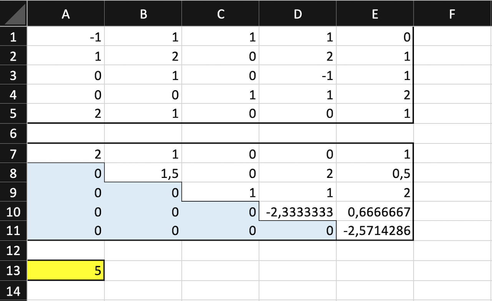

# Description
There are multiple software alternatives to calculate the rank of a matrix (in Python numpy, Matlab, R, etc.). But this subroutine is for those who strongly prefers VBA in Excel.
This VBA code transforms a matrix into the row echelon form and calculates its rank.

# How to use it
One needs to use this VBA subroutine with an Excel worksheet that contains an up to 1000 to 1000 not necessarily square matrix in the upper left corner of that Excel spreadsheet. The matrix must have a boundary of empty cells in at least the first row and first column.
The code prints this matrix in the row echelon form below the original matrix and prints its rank below that.

